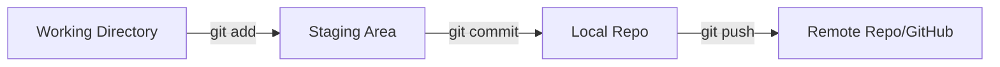
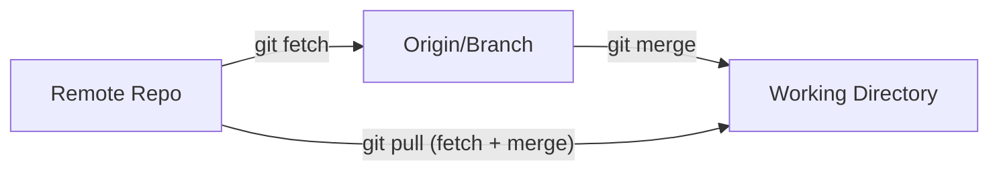

# Git CLI Cheatsheet

Panduan singkat perintah Git yang sering digunakan untuk manajemen repository sehari-hari.

## 1. Visualisasi Workflow (Diagram)

Memahami bagaimana data bergerak antar area di Git.

### A. Basic Workflow (Simpan & Upload)
Proses standar dari koding sampai masuk ke GitHub/Server.



**Visual Sederhana:**
```txt
[ File Kodingan ] --(git add)--> [ Siap Dicatat ] --(git commit)--> [ History Lokal ] --(git push)--> [ GitHub ]
```

### B. Pull & Update Flow (Ambil Update)
Bagaimana cara mengambil perubahan teman tim ke komputermu.



### C. Stash Workflow (Simpan Sementara)
Berguna saat harus pindah branch tapi kodingan belum selesai.

```txt
[ Kodingan Berantakan ] --(git stash)--> [ Saku Ajaib (Disimpan) ]
          ^                                       |
          |--------(git stash pop)----------------|
```

### D. Undo & Reset (Batalkan Perubahan)
Hati-hati! Beberapa perintah ini bisa menghapus pekerjaanmu.

```txt
history (Commit)  <--(git reset)--  [ Staging Area ]  <--(git restore --staged)--  [ Working Directory ]
                                                                                         |
[ Kondisi Awal ]  <----------------(git checkout/restore)--------------------------------|
```

---

## 2. Branching & Navigasi

Perintah untuk melihat, membuat, dan berpindah antar branch.

| Aksi | Perintah | Keterangan |
| :--- | :--- | :--- |
| **Cek Branch Aktif** | `git branch` | Menampilkan list branch lokal. Tanda `*` adalah branch aktif. |
| **Lihat Semua Branch** | `git branch -a` | Menampilkan branch lokal dan remote (server). |
| **Pindah Branch** | `git checkout <nama-branch>` | Pindah ke branch yang sudah ada. |
| **Buat & Pindah** | `git checkout -b <nama-baru>` | Membuat branch baru dari posisi saat ini dan langsung pindah ke sana. |
| **Ambil Branch Server**| `git checkout -b <nama> origin/<nama>` | Mengambil branch dari server (misal `beta_v2`) ke lokal. |

> **Tips:** Di versi git terbaru, kamu juga bisa pakai `git switch <nama-branch>` untuk pindah, dan `git switch -c <nama-baru>` untuk buat baru.

## 3. Simpan Perubahan (Commands)

| Aksi | Perintah | Keterangan |
| :--- | :--- | :--- |
| **1. Pilih File** | `git add .` | Memilih semua file yang berubah untuk disiapkan (Staging). |
| **2. Simpan** | `git commit -m "pesan"` | Menyimpan perubahan secara permanen di history komputer kamu. |
| **3. Upload** | `git push origin <branch>` | Mengirim commit kamu ke server (GitHub). |

## 4. Troubleshooting & Undo

| Situasi | Solusi Command |
| :--- | :--- |
| **Salah add file** | `git restore --staged <file>` <br> (Mengeluarkan file dari Staging, tapi tidak menghapus editannya) |
| **Salah edit (mau balik awal)** | `git checkout -- <file>` atau `git restore <file>` <br> (**Bahaya!** Perubahan hilang permanen, balik ke save terakhir) |
| **Mau pindah tapi error** | `git stash` <br> (Simpan codingan nanggung ke tempat aman agar branch bersih) |
| **Balikin codingan nanggung** | `git stash pop` |
